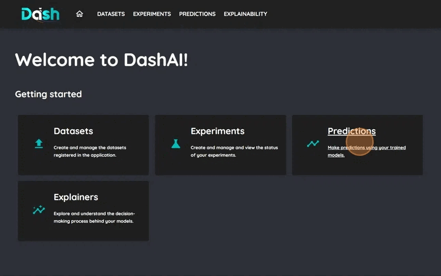
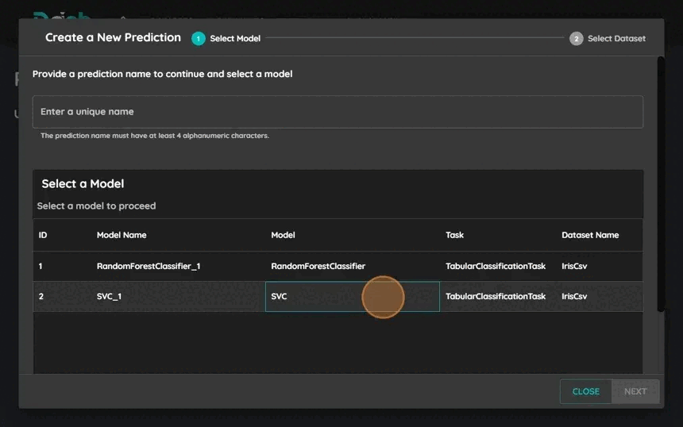
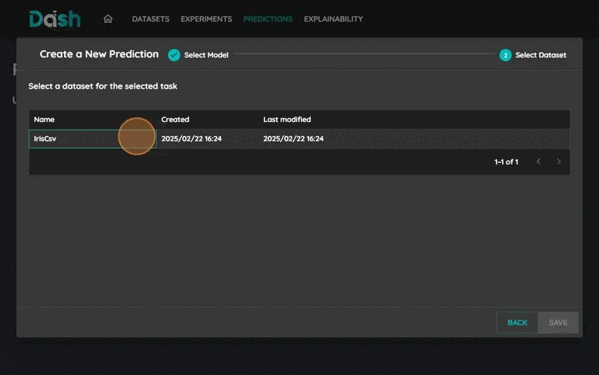
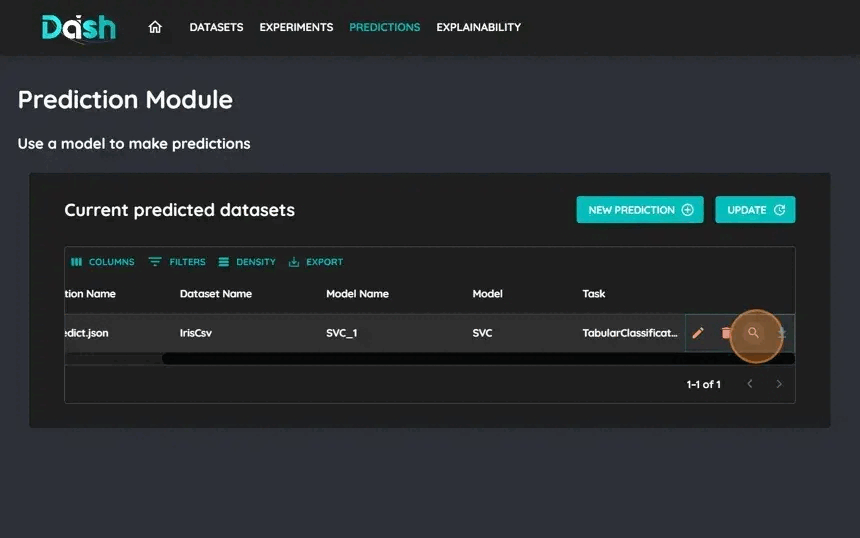

=================
Make Predictions
=================

This tutorial will guide you through the process of making predictions using trained models in DashAI.

Prerequisites
-------------
Before starting, make sure you have:

* A trained model in DashAI
* A dataset for predictions with the same format as training data

Step-by-Step Guide
------------------

1. Create new prediction
~~~~~~~~~~~~~~~~~~~~~~~~

Click on the "Predictions" button in the navigation bar.
Click on the "New Prediction" button to start the prediction process.

2. Select Model
~~~~~~~~~~~~~~~

* Select the trained model you want to use
* Enter a name for your prediction
* Click "Next" to proceed

3. Select Prediction Dataset
~~~~~~~~~~~~~~~~~~~~~~~~~~~~

* Choose the dataset you want to use for predictions
* Click "Save" to proceed

5. View Prediction Results
~~~~~~~~~~~~~~~~~~~~~~~~~~

* Review the prediction results
* Download the predictions if needed

Tips and Best Practices
------------------------

* Ensure your prediction dataset has the same format as training data
* Verify that all required input columns are present
* Use the same preprocessing steps as during training

Troubleshooting
---------------

* Common issues:
    - Missing columns
    - Different column names
    - Incompatible data types
    - File format errors
