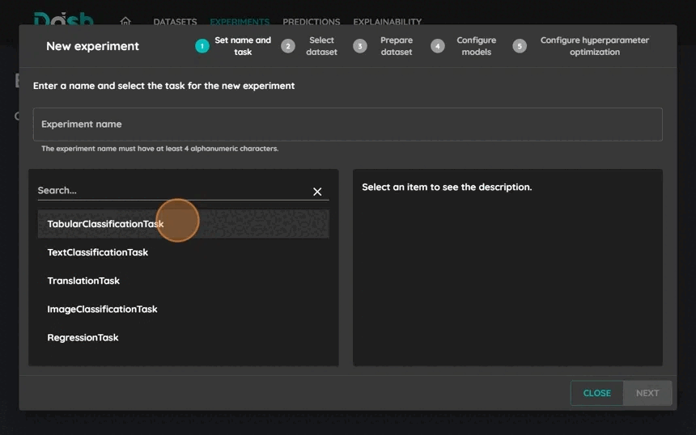

=================
Train a Model
=================

This tutorial will guide you through the process of training a model using DashAI.

Prerequisites
-------------
Before starting, make sure you have:

* A dataset uploaded to DashAI
* Understanding of your dataset's columns (features and target)

Step-by-Step Guide
------------------

1. Access the Experiments Section
~~~~~~~~~~~~~~~~~~~~~~~~~~~~~~~~~

Click on the "Experiments" button in the navigation bar to access the experiments interface.

2. Create New Experiment
~~~~~~~~~~~~~~~~~~~~~~~~

.. image:: ../tutorials/images/train_model/step2.jpeg
   :alt: Create new experiment
   :width: 600

Click on the "New Experiment" button to start creating your experiment.

3. Select Task and Set Name
~~~~~~~~~~~~~~~~~~~~~~~~~~~

* Write a name for your experiment
* Select the appropriate task type for your problem:
    - Text Classification
    - Tabular Classification
    - Image Classification
    - Regression
    - Translation
* Click "Next" to proceed

4. Select Dataset
~~~~~~~~~~~~~~~~~

* Choose the dataset you want to use for training
* Click "Next" to proceed

5. Configure Input/Output and Splits
~~~~~~~~~~~~~~~~~~~~~~~~~~~~~~~~~~~~

* Select the input columns (features)
* Select the output column (target)
* Configure the train/test/validation splits
* Click "Next" to proceed

6. Select and Configure Model
~~~~~~~~~~~~~~~~~~~~~~~~~~~~~

You can select multiple models to train and compare their performance. For each model:

1. Click on the "Select a model to add" button

2. Choose a model suitable for your task

3. Configure the model parameters

4. Repeat to add more models

Here are some recommended model combinations for each task type:

* For Text Classification:
    - DistilBERT + Bag of Words: Compare simple vs advanced approaches
    - Multiple DistilBERT instances with different parameters
* For Tabular Classification:
    - Random Forest + Logistic Regression: Compare linear vs non-linear methods
    - SVC + Random Forest: Compare different algorithmic approaches
* For Image Classification:
    - Different ViT configurations to compare performance
* For Regression:
    - Linear Regression + Random Forest: Compare simple vs complex relationships
    - Multiple SVR instances with different kernels

.. note::
   Training multiple models allows you to:

   * Compare performance across different architectures

   * Find the best model for your specific dataset

   * Understand trade-offs between complexity and performance

   * Experiment with different hyperparameter configurations

For a complete list of available models and their detailed documentation, see :ref:`Models <models>`.

7. Model Optimization
~~~~~~~~~~~~~~~~~~~~~

DashAI provides automatic model optimization through:

* **Hyperparameter Optimization**: Find the best parameters for your model automatically
    - Each parameter combination is evaluated using the selected optimization metric
    - Example parameters to optimize:
        - SVC: Regularization parameter (C)
        - Random Forest: Number of trees, maximum depth

* **Optimization Metrics**: The metric used to compare different parameter combinations
    - Classification:
        - Accuracy: Overall correctness
        - F1-score: Balance between precision and recall
        - Precision: Exactness of positive predictions
        - Recall: Completeness of positive predictions
    - Regression:
        - Root Mean Squared Error (RMSE): Root mean squared error
        - Mean Absolute Error (MAE): Mean absolute error
    - Translation:
        - BLEU: Similarity between translations
        - TER: Translation edit rate

* **Optimizers**: Algorithms that guide the hyperparameter search
    - OptunaOptimizer: Efficient parameter search using Bayesian optimization
    - HyperOptOptimizer: Tree-structured Parzen Estimators for parameter search

.. note::
   The optimization process will:
   1. Try different parameter combinations
   2. Evaluate each combination using the selected metric
   3. Keep the parameters that achieve the best metric value

8. Train and review results
~~~~~~~~~~~~~~~~~~~~~~~~~~~

.. image:: ../tutorials/images/train_model/step8.gif
   :alt: Select model
   :width: 600

To train your models:

1. Click "Start" to start the training process

2. Wait for training completion

3. Review the model's performance metrics

4. Compare with other runs

Tips and Best Practices
-----------------------

* Start with a small dataset to test your configuration
* Try different model architectures for your task
* Use appropriate evaluation metrics for your problem
* Save successful model configurations for future use
* Consider using model optimization for better results

Troubleshooting
---------------

* If training fails, check:
    - Dataset format and preprocessing
    - Model parameter values
    - System resources (memory, GPU)
* For poor performance:
    - Review feature selection
    - Adjust model hyperparameters
    - Consider data preprocessing
    - Try different model architectures
