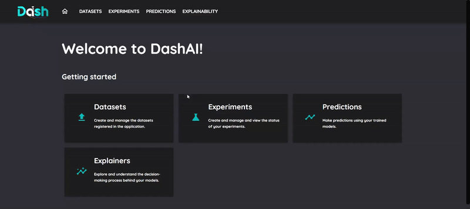
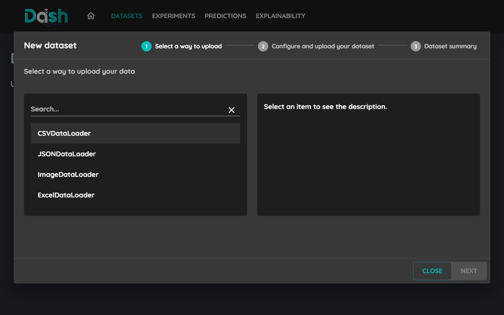
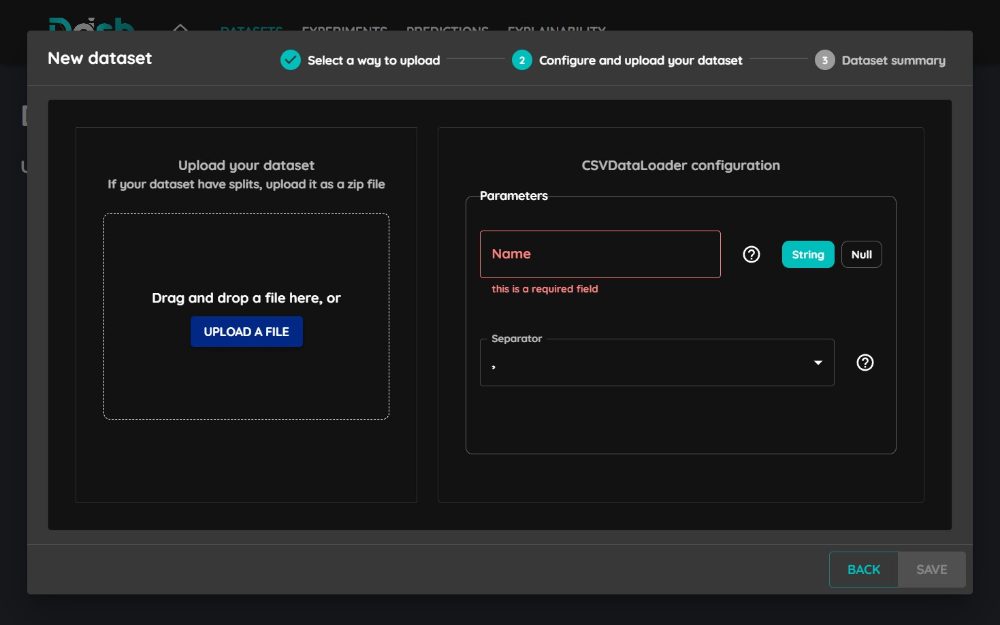
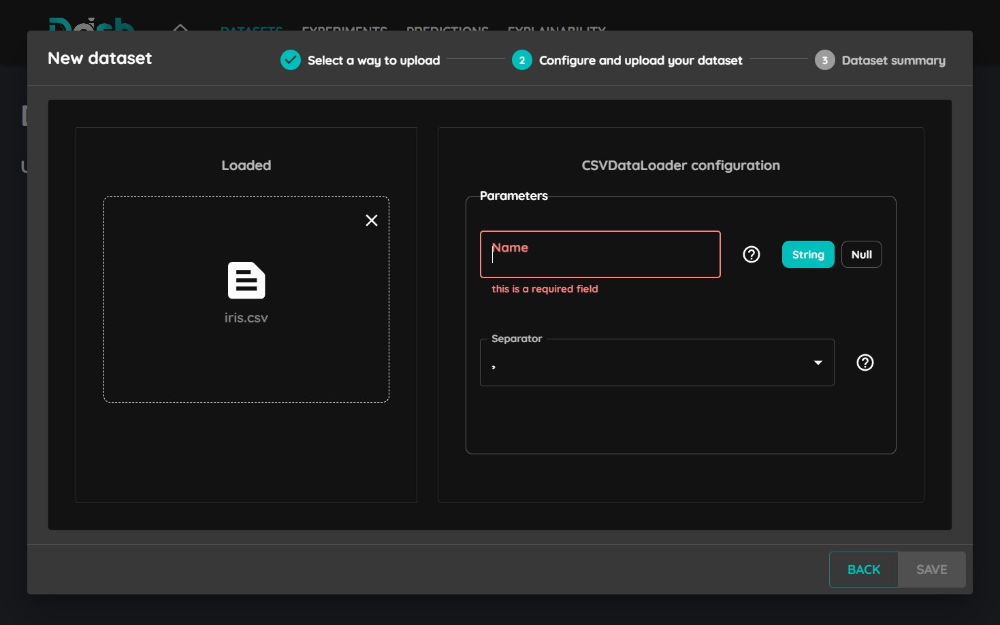
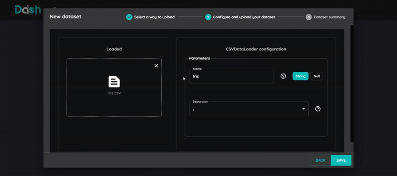

=================
Upload a Dataset
=================

This tutorial will guide you through the process of uploading a dataset to DashAI.

Supported Formats
-----------------
DashAI supports various dataset formats:

* CSV files (.csv)
* Excel files (.xlsx, .xls)
* JSON files (.json)
* Image datasets (as .zip files)

Step-by-Step Guide
------------------

1. Access the Datasets Section
~~~~~~~~~~~~~~~~~~~~~~~~~~~~~~

Click on the "New Dataset" button in the navigation bar to access the dataset upload interface.

2. Select Dataloader
~~~~~~~~~~~~~~~~~~~~

Click on the corresponding dataloader for your dataset format, in this case CSV then click next.

3. Select Your File
~~~~~~~~~~~~~~~~~~~

Click "Upload a File" and select your dataset file from your computer.

4. Configure Parameters
~~~~~~~~~~~~~~~~~~~~~~~

Set the appropriate parameters for your dataset:

* For CSV files:
    - Name
    - Delimiter (comma, semicolon, etc.)

* For JSON files:
    - Name
    - Data Key (Key where the data is located)

* For Excel files:
    - Sheet name
    - Header (The row number where the column names are located)
    - Usecols (Columns to load)

5. Upload and Verify
~~~~~~~~~~~~~~~~~~~~

1. Click the "Save" button
2. Wait for the upload to complete
3. Check the summary to ensure correct loading
4. Verify your dataset in the datasets list

Tips and Troubleshooting
-------------------------

* Ensure your file is in a supported format
* Check file size limits (3GB for dataset)
* Verify data integrity before upload
* Ensure select the correct dataloader for your dataset format
* Check the dataset summary for any errors
